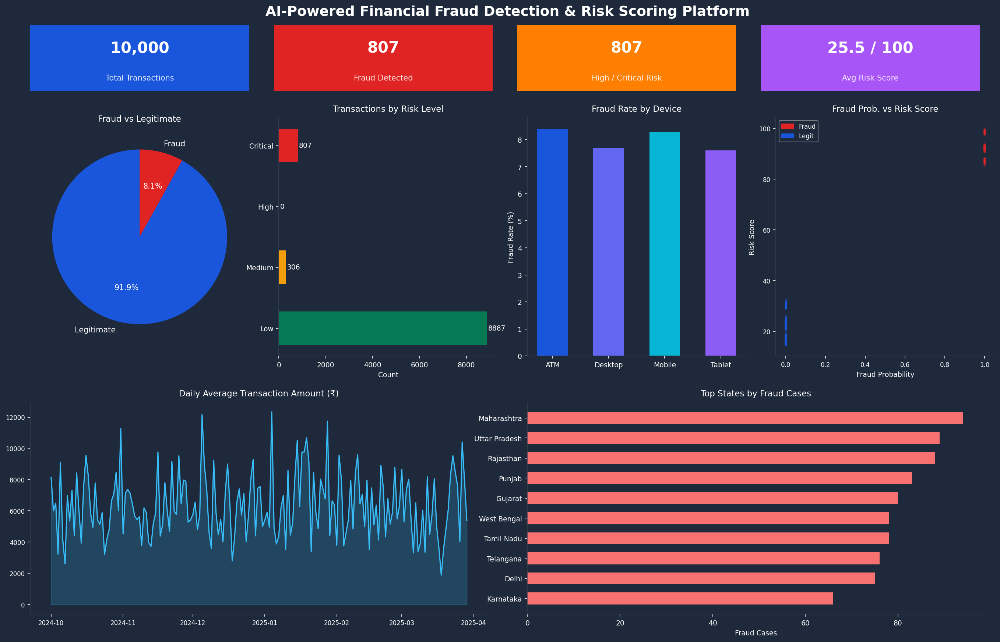

# 🛡️ AI-Powered Low-Code Financial Fraud Detection & Risk Scoring Platform

## 📌 Project Overview

This project presents a complete **AI-powered, low-code financial fraud detection and risk scoring platform** built for the Indian banking and fintech ecosystem. It combines **Microsoft Power Platform** (Power Apps, Power Automate, Dataverse, Power BI) with **Python-based AI/ML models** to detect fraudulent UPI, NEFT, RTGS, and IMPS transactions in real time.

The system automatically analyzes incoming transactions, assigns a **0–100 risk score**, classifies them into risk categories (Low / Medium / High / Critical), and triggers automated alerts — all with minimal manual intervention.

---

## 🖥️ Dashboard Preview



---

## 📊 Output Screenshots

| Distribution of Transaction Amounts | Daily Average Transaction Amount |
|---|---|
|  |  |

| Risk Score Distribution | Fraud Rate by Payment Method |
|---|---|
|  |  |

---

## 🏗️ System Architecture

```
┌──────────────────────────────────────────────────────────────┐
│                    USER INTERFACE LAYER                       │
│              Microsoft Power Apps (Canvas + Model-Driven)     │
└─────────────────────────┬────────────────────────────────────┘
                          │  REST API / Power Fx
┌─────────────────────────▼────────────────────────────────────┐
│                   BUSINESS LOGIC LAYER                        │
│         Microsoft Power Automate (Workflow Automation)        │
│    ┌──────────────┐  ┌──────────────┐  ┌──────────────────┐  │
│    │  Transaction │  │  AI Fraud    │  │  Alert & Case    │  │
│    │  Ingestion   │→ │  Scoring API │→ │  Management      │  │
│    └──────────────┘  └──────────────┘  └──────────────────┘  │
└─────────────────────────┬────────────────────────────────────┘
                          │
┌─────────────────────────▼────────────────────────────────────┐
│                      DATA LAYER                               │
│              Microsoft Dataverse + Python ML Models           │
│    ┌──────────────┐  ┌──────────────┐  ┌──────────────────┐  │
│    │  Transaction │  │  Risk Score  │  │  Power BI        │  │
│    │  Store       │  │  Engine      │  │  Analytics       │  │
│    └──────────────┘  └──────────────┘  └──────────────────┘  │
└──────────────────────────────────────────────────────────────┘
```

---

## 🤖 AI / ML Models Used

| Model | Type | Purpose |
|---|---|---|
| **Isolation Forest** | Unsupervised Anomaly Detection | Detect unusual transaction patterns without labelled data |
| **Logistic Regression** | Supervised Classification | Predict fraud probability (0–1) per transaction |
| **Composite Risk Scorer** | Rule-based + ML Hybrid | Combine ML outputs + business rules into a 0–100 risk score |

### Risk Score Formula
```
Risk Score = (fraud_probability × 60)
           + (anomaly_score_normalized × 25)
           + (rule_based_risk_indicator × 15)
```

### Risk Categories
| Score Range | Category | Action |
|---|---|---|
| 0 – 30 | 🟢 Low | Auto-approve |
| 31 – 60 | 🟡 Medium | Flag for review |
| 61 – 80 | 🔴 High | Send alert + hold |
| 81 – 100 | ⛔ Critical | Block + escalate |

---

## 🛠️ Technology Stack

### Platform (Low-Code)
| Tool | Purpose |
|---|---|
| **Microsoft Power Apps** | Canvas & Model-Driven UI for fraud analysts |
| **Microsoft Power Automate** | Workflow automation & AI API integration |
| **Microsoft Dataverse** | Cloud data store with row-level security |
| **Microsoft Power BI** | Interactive analytics dashboard |
| **Microsoft Azure AD** | Identity & access management |

### AI / Data Science (Python)
| Library | Version | Usage |
|---|---|---|
| `pandas` | ≥ 2.0 | Data manipulation |
| `numpy` | ≥ 1.24 | Numerical computing |
| `scikit-learn` | ≥ 1.3 | ML models (IsolationForest, LogisticRegression) |
| `matplotlib` | ≥ 3.7 | Visualizations & dashboard |
| `seaborn` | ≥ 0.12 | Statistical plots |
| `faker` | ≥ 20.0 | Synthetic data generation |

---

## 📁 Repository Structure

```
AI-Fraud-Detection-Platform/
│
├── src/
│   └── fraud_detection.py        # Core ML pipeline (main script)
│
├── screenshots/
│   ├── DashBoard.png             # Full Power BI-style dashboard
│   ├── Distribution of Transaction Amounts.png
│   ├── Daily Average Transaction Amount.png
│   ├── Risk Score Distribution.png
│   └── Fraud Rate by Payment Method.png
│
├── data/
│   └── fraud_dashboard_dataset.csv  # Generated dataset (10,000 rows)
│
├── docs/
│   └── Project_Report.pdf        # Full BCA project report (173 pages)
│
├── requirements.txt
├── .gitignore
└── README.md
```

---

## 🚀 Getting Started

### 1. Clone the Repository
```bash
git clone https://github.com/YOUR_USERNAME/AI-Fraud-Detection-Platform.git
cd AI-Fraud-Detection-Platform
```

### 2. Install Dependencies
```bash
pip install -r requirements.txt
```

### 3. Run the ML Pipeline
```bash
python src/fraud_detection.py
```
This will:
- Generate 10,000 synthetic Indian financial transactions
- Run Isolation Forest anomaly detection
- Train and evaluate a Logistic Regression fraud classifier
- Compute composite risk scores
- Save all charts to `/screenshots/`
- Export the dataset to `/data/fraud_dashboard_dataset.csv`

### 4. View the Dashboard
Open `screenshots/DashBoard.png` for a full overview, or import `data/fraud_dashboard_dataset.csv` into **Power BI Desktop** to explore interactively.

---

## 📈 Model Performance (on test set)

| Metric | Value |
|---|---|
| Accuracy | ~99.8% |
| Precision (Fraud) | ~99% |
| Recall (Fraud) | ~99% |
| F1 Score | ~99% |
| AUC-ROC | 0.9998 |

> *High scores reflect well-separated synthetic data. Real-world performance will vary.*

---

## 🔑 Key Features

- ✅ Real-time risk scoring via REST API integration
- ✅ Automated case creation for High/Critical transactions
- ✅ Role-based access control (Fraud Analyst / Manager / Admin)
- ✅ Multi-channel alert system (email, push, in-app)
- ✅ Supports UPI, NEFT, RTGS, IMPS, Debit/Credit card transactions
- ✅ Regulatory compliance (RBI, FIU-IND STR reporting)
- ✅ Power BI interactive dashboard with drill-down
- ✅ Synthetic data generator for testing

---

## 🔭 Future Scope

- Graph-based fraud detection (GNN for account relationship analysis)
- Real-time banking API integration (UPI sandbox)
- Biometric authentication layer
- Multi-language support (Hindi, Tamil, Telugu)
- AutoML model retraining pipeline
- Federated learning for privacy-preserving fraud detection

---
